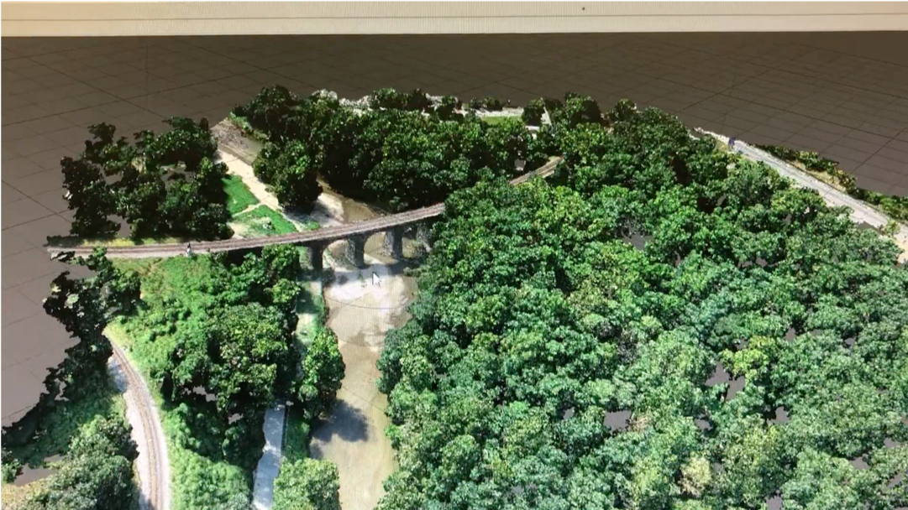

The Bloede Dam removal was one of the biggest dam removals on the east coast, which had a goal of improving public safety as well as returning the river back to its natural form so that fish populations could recover. Our team at UMBC was employed by
American Rivers to test out a new method of river physical monitoring using emerging drone technology. 

Using drone aerial imagery, photos were used in a structure-from-motion process to recreate the reaches in digital form. 
The point clouds that were created were then used to make digital elevation models as well as orthomosaics of the river. The photo below shows a point cloud that was created from the lower flood plain of the Patapsco. These clouds are made up of millions of points that each have XYZ values associated with them.

