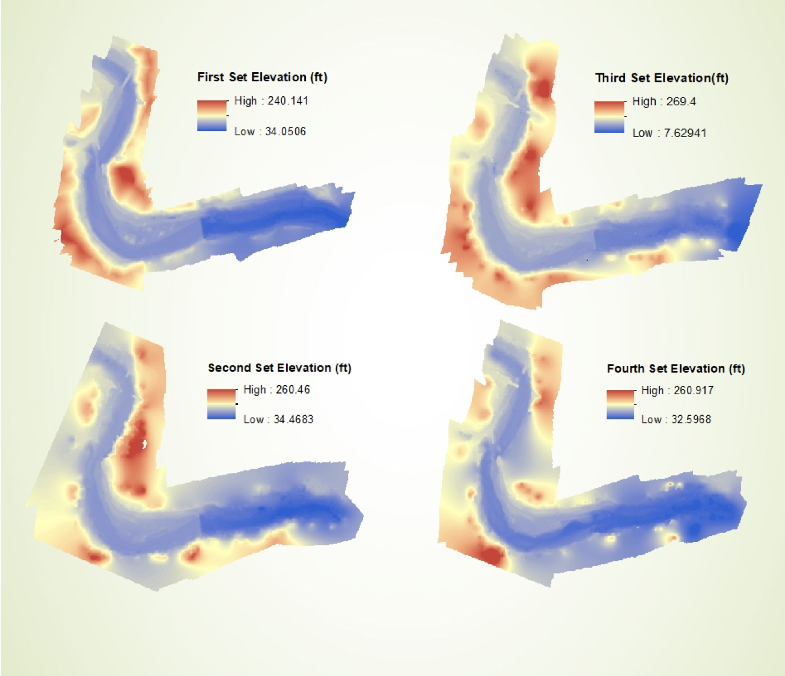

The Bloede Dam removal was one of the biggest dam removals on the east coast, which had a goal of improving public safety as well as returning the river back to its natural form so that fish populations could recover. Our team at UMBC, along with other teams at USGS and MGS, were employed by American Rivers to track the sediment deposition along the channel as the sediment load from behind the dam drained. 

Our team specifically is testing a new method of physical monitoring which utilizes emerging drone techonology to create virtual models of the river. Using drone aerial imagery, photos were used in a structure-from-motion process to recreate the reaches in digital form. The point clouds that were created were then used to make digital elevation models (DEMs) as well as orthomosaics of the river. An example of what the point cloud looks like is shown below. 

The DEMs can be used to make elevation difference maps which enable us to make volumetric calculations of the sediment behind the dam and around the channel. The orthomosaics have the potentail to allow us to track changes in substrate type around the channel. 

So far, we have 4 completed orthomosaics of the dam. The first orthomosaic is from May 2018 which was before the second Ellicott City flood. That orthomosaic is shown below.

The second orthomosaic is from September 2018, the day before the dam removal started. That orthomosaic is shown below. 

The third orthomosaic is also from September 2018, and was created from imagery taken the day after the dam removal started. That orthomosaic is shown below 

The last orthomosaic is from October 2018, after the dam removal was almost complete. That orthomosaic is shown below. 

Just from the orthophotos alone, you can see a drastic change in the channel shape. In order to see the amount of sediment that moved from behind the dam, we created DEMs from each set of imagery, which were then used to make difference of elevation maps. The DEMs created are shown below. 

__Team Members:__ Matthew Baker, Andrew Miller, Kristian Nelson, Ryand Wooldridge

