This project looks at the risks of lava flow and wild fires that expensive homes in Hawaii face. For this project, I wanted to create a mock-up house insurance quote job that would look at where homes on Hawaii are at most risk. Insurance companies then use these findings to determine whether they want to insure a home or not, and how much the insurance will cost. I specifically looked at lava flow and fire because those were the two variables I was most interested in. Of course, there are many other risks that home owners face in this part of the world. 

For context and to get a visual of what this island looks like, here is a 3D map of the big island of Hawaii. This was created from a [downloaded DEM](http://www.soest.hawaii.edu/coasts/data/hawaii/dem.html) and an overlaid basemap in QGIS. Elevations were exaggerated to show a better visual. 

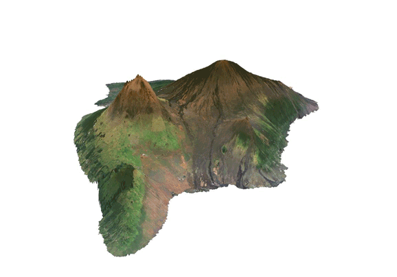

The first thing I had to do was gather housing data for the big island of Hawaii. I downloaded [parcel data](http://geoportal.hawaii.gov/datasets/1eb5fa03038d49cba930096ea67194e0_5) and extracted the homes that were above the average housing price in Hawaii. I used SQL to run a query to make this selection, and only choose buildings that were residential, or being rented out to residents. The query I ran is below. 

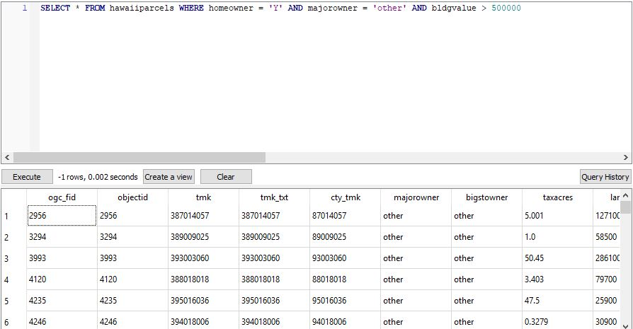

The next step was to load in the [lava flow data](http://geoportal.hawaii.gov/datasets/volcano-lava-flow-hazard-zones) and the [fire risk data](http://geoportal.hawaii.gov/datasets/fire-risk-areas). I used python scripts to make a selection from each of the data sets because there was a lot of extra information that wasn't needed. For instance, the lava flow data had over 9 specific zones, but zone 9 through zone 3 were used to show historic lava flows. Zones 1 through 3 were the zones that showed current lava flow risk, so I needed to select only these zones. The same system was used for the fire risk data. The scripts I used are shown below.

__Script to load in and edit lava flow data:__

```python
lavahazard = QgsVectorLayer('Z:/GES486/Final_Project/Volcano_Lava_Flow_Hazard_Zones/Volcano_Lava_Flow_Hazard_Zones.shp', 'lavahazard')
lavahazard.isValid()
# Should Return "True"
QgsProject.instance().addMapLayer(lavahazard)
# Should return "<qgis._core.QgsVectorLayer object at 0x000001714E5500D8>"

selection = lavahazard.getFeatures(QgsFeatureRequest(). setFilterExpression(u'"hzone" < 4'))
lavahazard.selectByIds([s.id() for s in selection])
iface.mapCanvas().zoomToSelected()
QgsVectorFileWriter.writeAsVectorFormat(lavahazard, r'Z:/GES486/Final_Project/Volcano_Lava_Flow_Hazard_Zones/lavahazardselect.gpkg', 'utf-8', lavahazard.crs(),'GPKG', True)

LavaHazardSelect = QgsVectorLayer('Z:/GES486/Final_Project/Volcano_Lava_Flow_Hazard_Zones/lavahazardselect.gpkg', 'LavaHazardSelect')
LavaHazardSelect.isValid()
QgsProject.instance().addMapLayer(LavaHazardSelect)
```

__Script to load in and edit fire risk data:__

```python
firehazard = QgsVectorLayer('Z:/GES486/Final_Project/Fire_Risk_Areas/Fire_Risk_Areas.shp', 'firehazard')
firehazard.isValid()
# Should Return "True"
QgsProject.instance().addMapLayer(firehazard)
# Should return "<qgis._core.QgsVectorLayer object at 0x000001714E5500D8>"

selection = firehazard.getFeatures(QgsFeatureRequest(). setFilterExpression(u'"risk_ratin" = \'High\' OR "risk_ratin" = \'Medium\' OR "risk_ratin" = \'Low\''))
firehazard.selectByIds([s.id() for s in selection])
iface.mapCanvas().zoomToSelected()
QgsVectorFileWriter.writeAsVectorFormat(firehazard, r'Z:/GES486/Final_Project/Fire_Risk_Areas/firehazardselect.gpkg', 'utf-8', firehazard.crs(),'GPKG', True)

FireHazardSelect = QgsVectorLayer('Z:/GES486/Final_Project/Fire_Risk_Areas/firehazardselect.gpkg', 'FireHazardSelect')
FireHazardSelect.isValid()
QgsProject.instance().addMapLayer(FireHazardSelect)
```
Maps were then created showing the fire risk and lava flow risk around the island and are shown below. I focused in on three areas of the island that had a lot of expensive homes to see where they landed in these risk areas. Waikoloa Village is in the northwestern part of the island, Hilo is in the northeastern side of the island, and Kahaluu-Keauhou is in the southwester side of the island just above Captain Cook. The map below shows town locations which was taken from [Hawaii Guide](https://www.hawaii-guide.com/big-island/big-island-hawaii-maps).

__Location Map:__

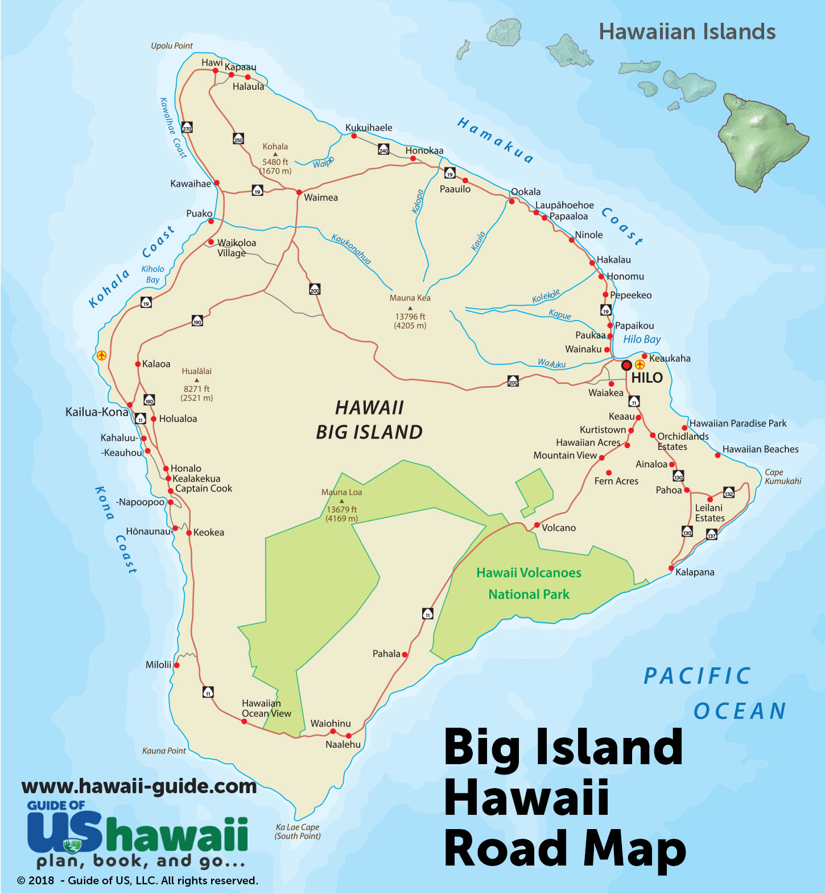

__Lava Flow Risk Map:__

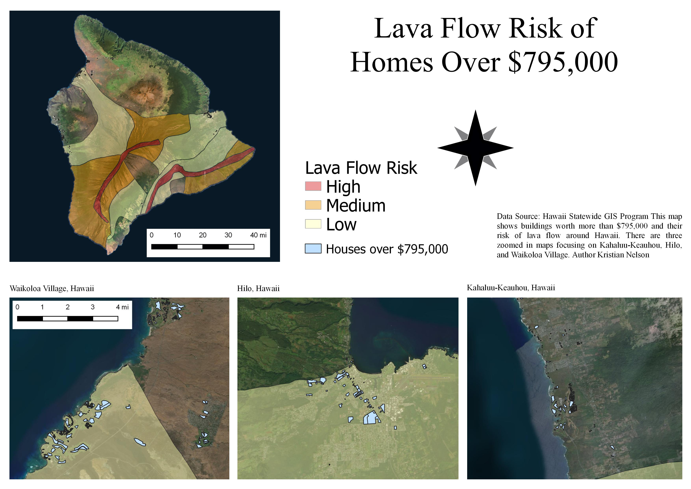

You can see that the town of Kahaluu-Keauhou does not have any risk of lava flow based on current active volcanoes. The town of Hilo has some risk of lava flow, but is not at high risk or even at medium risk. Only the resort area of Waikoloa Village has some risk of lava flow, but the town to the east does not have any risk based on current active volcanoes. 

In addition to this map, 3D maps were created to show why the lava flows the way it does. This was created using the same [downloaded DEM](http://www.soest.hawaii.edu/coasts/data/hawaii/dem.html) and overlaying the lava flow shapefile. The first image shows the north side of the island and the second shows the south side. As you can see, there is a lot more risk on the south side. 

__North Side:__

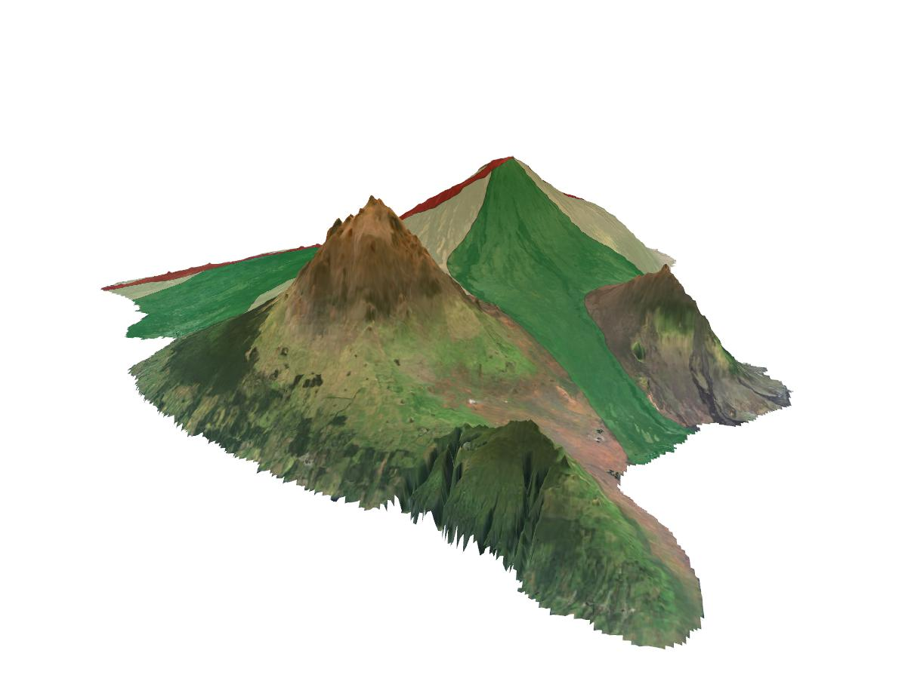

__South Side:__

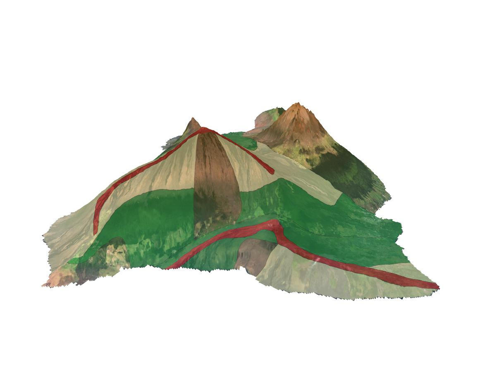

__Fire Risk Map:__

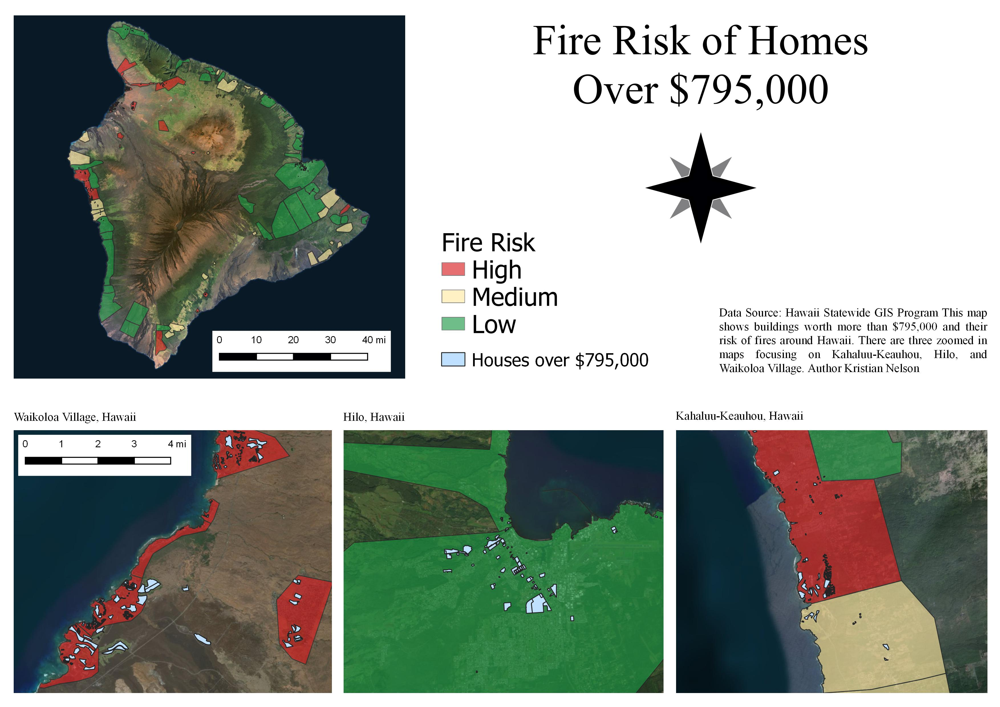

According to this map, Waikoloa and Kahaluu-Keaulou ar both in high risk areas of fires, with some parts either having medium risk or no risk at all. Hilo has the lowest risk out of all 3 towns when it comes to risk of fires. 


I was curious to see if there was any correlation between lava flow paths and areas of fire risk. Are high risk areas of fires also at high risk areas of lava flow? Or are high risk areas of lava flow at low risk of fires due to lack of dense vegetation? To do this, I ran a multivariate Moran's I to build a cluster map.

__Cluster Map:__

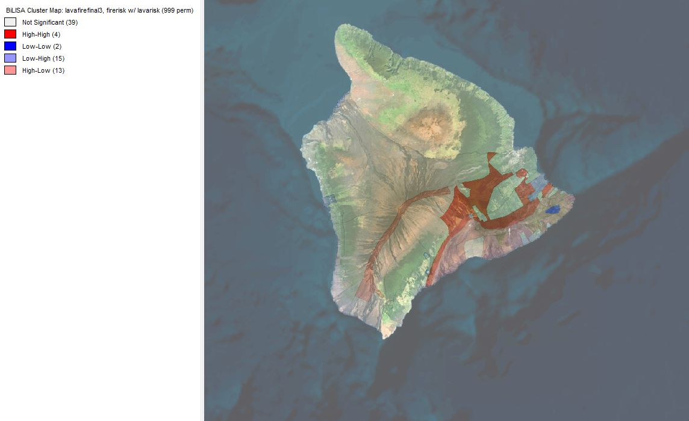

The results need to be looked at differently than how you would normally read this type of map. The highest value of risk in table of this data is 1. This means that the highest value (3) means low risk of either lava flow or fire. So areas that are High-High have low risk of lava flow, and low risk of fires. Areas with Low-Low have high risk of lava flow, and high risk of fires. To answer my question above, we look at the areas that have a value of High-Low. This shows that there is high risk of lava flow, but low risk of fires. These areas do not have a lot of vegetation which might prove that most of the time, where there is high risk of lava flow, there is low risk of fires. 

As an extra visual, I was curious to see how the island looked after the eruption of Kilauea on May 3, 2018. A map of the areas this eruption affected is shown below, which was taken from [Hawaii Forest & Trail](https://www.hawaii-forest.com/volcano-eruption-update/).

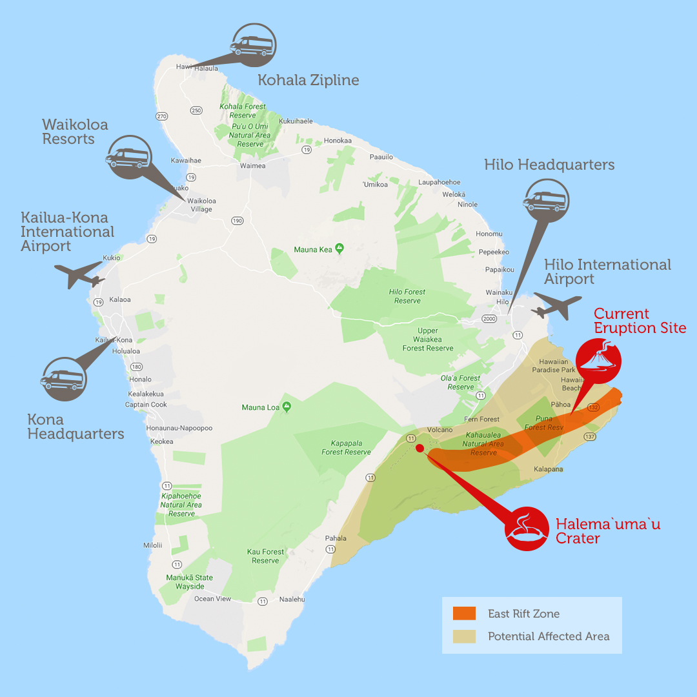

This is a recent eruption that could show these lava flow zones in real life, and not just as a shape file. To do this, I had to download four sets of Landsat 8 imagery from the [USGS Earth Explorer](https://earthexplorer.usgs.gov/). I then took only the thermal band from each set and created a mosaic from them in ArcMap. The thermal mosaic was then given a color ramp and overlaid with a DEM to show how the temperature differences on the island around that time. 

__Thermal IR 3D Map:__

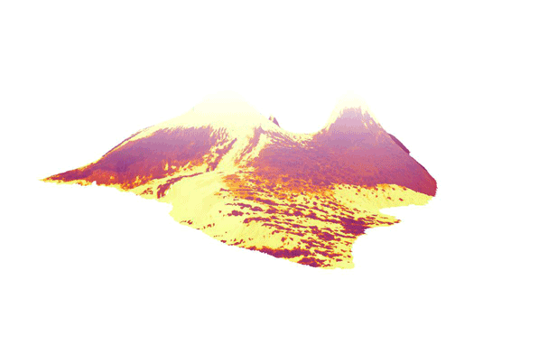

There are some errors due to clouds and the mosaic process, but you can see clearly where the ground is hotter due to lack of vegetation, as well as where the lava was actually flowing on the south side of the island. The image below stops on the side where the eruption of 2018 occured. 

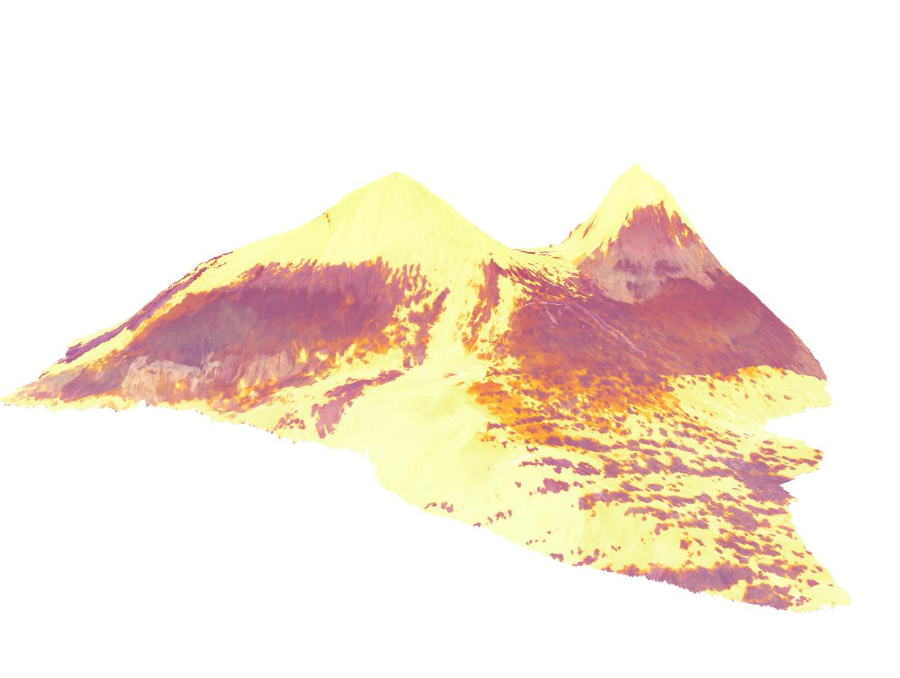

The map below was created to show a comparison of the thermal IR and the lava flow zones. You can see that there is some overlap of where there is high temperature and where there is a risk of lava flow. Specifically, you will notice that where the eruption was is also where there is high risk of lava flow. 

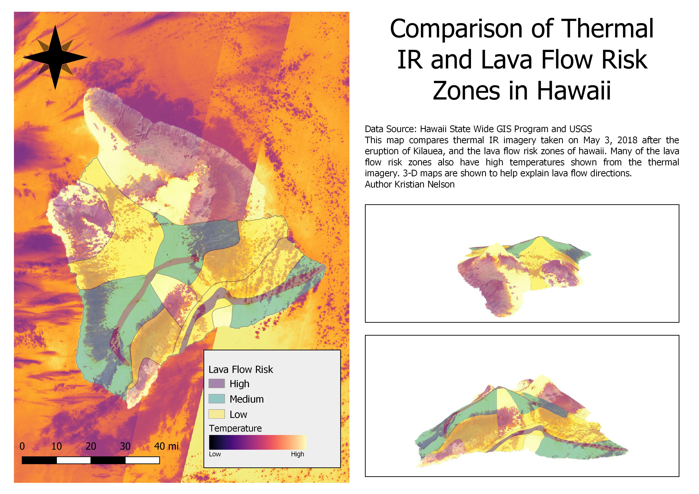

From the information shown, you can see the areas around Hawaii that have risks that other areas don't have. This is useful information for not only insurance companies, but people who are trying to build a home or buy a home somewhere on the island. With the eruption of Kilauea just last summer, the threat of lava flow is still very real, and the same goes for fires. It is imporant to understand where these risks occur spatially so that policies can be put in place and people can stay safe. My analysis is not something that only applies to Hawaii, but is something that can be done for areas all over the world. Whether it is flooding, hurricanes, or any other natural disaster, risk assessments are valuable to not only companies, but regular people who are trying to stay safe in this changing climate. With climate change becoming more of risk and previously safe environments becoming more hazardous, it is extremely important to know where areas of risk are so that further damage can be avoided. 

__Author:__ Kristian Nelson

__Languages:__ HTML, Markdown, Python, SQL

__Applications:__ QGIS, ENVI, Arcmap, GeoDa

__Data Sources:__ [Hawaii Forest & Trail](https://www.hawaii-forest.com/volcano-eruption-update/), 
 [USGS Earth Explorer](https://earthexplorer.usgs.gov/), [DEM](http://www.soest.hawaii.edu/coasts/data/hawaii/dem.html), [Hawaii Guide](https://www.hawaii-guide.com/big-island/big-island-hawaii-maps), [Parcel Data](http://geoportal.hawaii.gov/datasets/1eb5fa03038d49cba930096ea67194e0_5), [Lava Flow Data](http://geoportal.hawaii.gov/datasets/volcano-lava-flow-hazard-zones), [Fire Risk Data](http://geoportal.hawaii.gov/datasets/fire-risk-areas)
