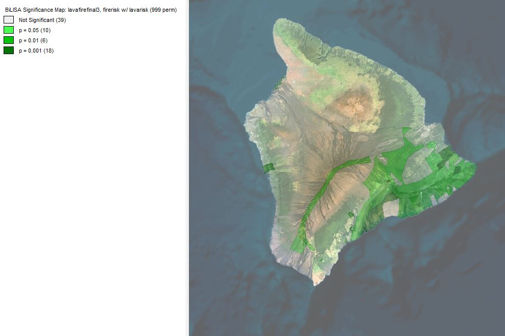

This project looks at the risks of lava flow and wild fires that expensive homes in Hawaii face. For this project, I wanted to create a mock-up house insurance quote job that would look at where homes on Hawaii are at most risk. Insurance companies then use these findings to determine whether they want to insure a home or not, and how much the insurance will cost. I specifically looked at lava flow and fire because those were the two variables I was most interested in. Of course, there are many other risks that home owners face in this part of the world. 

The first thing I had to do was gather housing data for the big island of Hawaii. I downloaded [parcel data](http://geoportal.hawaii.gov/datasets/1eb5fa03038d49cba930096ea67194e0_5) and extracted the homes that were above the average housing price in Hawaii. I used SQL to run a query to make this selection, and only choose buildings that were residential, or being rented out to residents. The query I ran is below. 


The next step was to load in the [lava flow data]() and the [fire risk data](). I used python scripts to make a selection from each of the data sets because there was a lot of extra information that wasn't needed. For instance, the lava flow data had over 9 specific zones, but zone 9 through zone 3 were used to show historic lava flows. Zones 1 through 3 were the zones that showed current lava flow risk, so I needed to select only these zones. The same system was used for the fire risk data. The scripts I used are shown below.

Script to load in and edit lava flow data:

```python
lavahazard = QgsVectorLayer('Z:/GES486/Final_Project/Volcano_Lava_Flow_Hazard_Zones/Volcano_Lava_Flow_Hazard_Zones.shp', 'lavahazard')
lavahazard.isValid()
# Should Return "True"
QgsProject.instance().addMapLayer(lavahazard)
# Should return "<qgis._core.QgsVectorLayer object at 0x000001714E5500D8>"

selection = lavahazard.getFeatures(QgsFeatureRequest(). setFilterExpression(u'"hzone" < 4'))
lavahazard.selectByIds([s.id() for s in selection])
iface.mapCanvas().zoomToSelected()
QgsVectorFileWriter.writeAsVectorFormat(lavahazard, r'Z:/GES486/Final_Project/Volcano_Lava_Flow_Hazard_Zones/lavahazardselect.gpkg', 'utf-8', lavahazard.crs(),'GPKG', True)

LavaHazardSelect = QgsVectorLayer('Z:/GES486/Final_Project/Volcano_Lava_Flow_Hazard_Zones/lavahazardselect.gpkg', 'LavaHazardSelect')
LavaHazardSelect.isValid()
QgsProject.instance().addMapLayer(LavaHazardSelect)
```

__Script to load in and edit fire risk data:__

```python
firehazard = QgsVectorLayer('Z:/GES486/Final_Project/Fire_Risk_Areas/Fire_Risk_Areas.shp', 'firehazard')
firehazard.isValid()
# Should Return "True"
QgsProject.instance().addMapLayer(firehazard)
# Should return "<qgis._core.QgsVectorLayer object at 0x000001714E5500D8>"

selection = firehazard.getFeatures(QgsFeatureRequest(). setFilterExpression(u'"risk_ratin" = \'High\' OR "risk_ratin" = \'Medium\' OR "risk_ratin" = \'Low\''))
firehazard.selectByIds([s.id() for s in selection])
iface.mapCanvas().zoomToSelected()
QgsVectorFileWriter.writeAsVectorFormat(firehazard, r'Z:/GES486/Final_Project/Fire_Risk_Areas/firehazardselect.gpkg', 'utf-8', firehazard.crs(),'GPKG', True)

FireHazardSelect = QgsVectorLayer('Z:/GES486/Final_Project/Fire_Risk_Areas/firehazardselect.gpkg', 'FireHazardSelect')
FireHazardSelect.isValid()
QgsProject.instance().addMapLayer(FireHazardSelect)
```
Maps were then created showing the fire risk and lava flow risk around the island. I focused in on three areas of the island that had a lot of expensive homes to see where they landed in these risk areas. Below are the fire and lava risk maps.

__Lava Flow Risk Map:__


You can see that the town of Kahaluu-Keauhou does not have any risk of lava flow based on current active volcanoes. The town of Hilo has some risk of lava flow, but is not at high risk or even at medium risk. Only the resort area of Waikoloa Village has some risk of lava flow, but the town to the east does not have any risk based on current active volcanoes. 

__Fire Risk Map:__


According to this map, Waikoloa and Kahaluu-Keaulou ar both in high risk areas of fires, with some parts either having medium risk or no risk at all. Hilo has the lowest risk out of all 3 towns when it comes to risk of fires. 

I was curious to see if there was any correlation between lava flow paths and areas of fire risk. Are high risk areas of fires also at high risk areas of lava flow? Or are high risk areas of lava flow at low risk of fires due to lack of dense vegetation? To do this, I ran a multivariate Moran's I to build a cluster map and a significance map. These maps are shown below. 

__Significance Map:__



__Cluster Map:__


