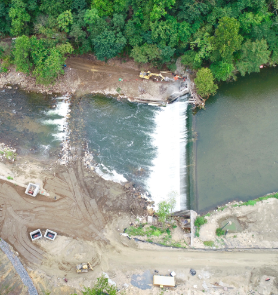
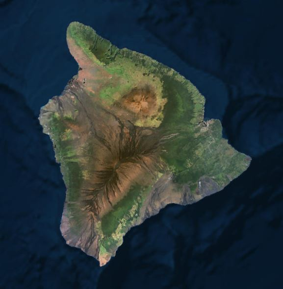

<!--This is the first row of projects -->

 
### Project 1: Baltimore Industries

<kbd></kbd>
[See more details here.](https://kristiannelson.github.io/project1/project_1.html)

<small>__Tools:__ QGIS, ArcMap, Atom, SQL
 
<small>__Data Source:__ [Baltimore City Open GIS Data](http://gis-baltimore.opendata.arcgis.com/),
 [MD iMap](https://imap.maryland.gov/Pages/lidar-dem-download-files.aspx)
 

&nbsp;	

### Project 2: Coral Bleaching

<kbd></kbd>
[See more details here.](https://kristiannelson.github.io/project2/project2.html)

<small>__Tools:__ QGIS, Atom, Python, Markdown
 
<small>__Data Source:__ [Reef Base](http://www.reefbase.org/main.aspx),
[Natural Earth Data](https://www.naturalearthdata.com/downloads/50m-raster-data/)

<!--This is the second row of projects -->

### Project 3: Bloede Dam Removal

[See more details here.](https://KristianNelson.github.io/bloededam/bloededameproject.html)

<small>__Tools__: Agisoft Photoscan, ArcMap, Cloud Compare

### Project 4: Hawaii Housing Risk

[See more details here.](https://KristianNelson.github.io/finalproject/finalproject.html)

<small>__Tools__: QGIS, Python, SQL, ENVI, ArcMap, GeoDa, Markdown

<small>__Data__:

