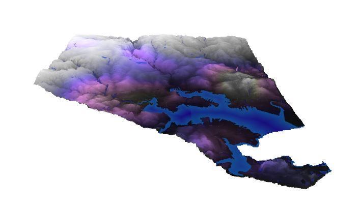
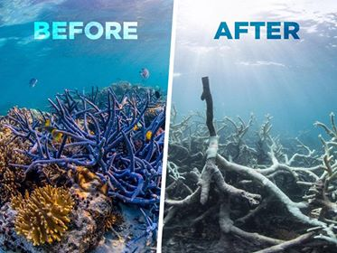

Kristian Nelson GIS Portfolio
=============================

<!--This is the first row of projects -->

 
### Project 1 

[See more details here.](https://kristiannelson.github.io/project1/project_1.html)

<small>__Tools:__ QGIS, ArcMap, Atom, SQL

<small>__Data Source:__ [Baltimore City Open GIS Data](http://gis-baltimore.opendata.arcgis.com/),
 [MD iMap](https://imap.maryland.gov/Pages/lidar-dem-download-files.aspx)

### Project 2

[See more details here.](https://kristiannelson.github.io/project2/project2.html)

<small>__Tools:__ QGIS, Atom, Python, Markdown

<small>__Data Source:__ [Reef Base](http://www.reefbase.org/main.aspx),
[Natural Earth Data](https://www.naturalearthdata.com/downloads/50m-raster-data/)

