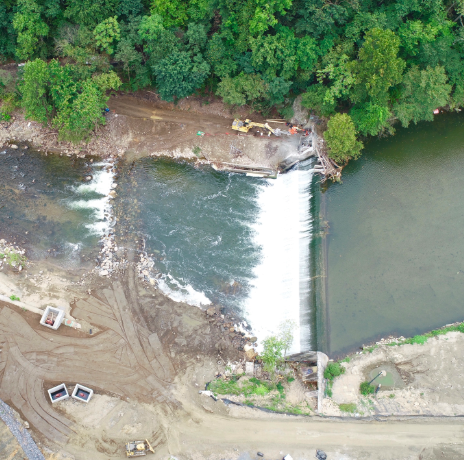

Welcome to my GIS portfolio! Here you can find some examples of projects I have worked on personally, or large scale research projects I am involved in. I am a graduate of the University of Maryland, Baltimore County and looking to get into the industry! I am seeking career building opportunities in the field of Environmental Science and Geography as an GIS Analyst, GIS Specialist, Environmental Specialist, or other related positions where I can apply and improve my current skills, expand upon my knowledge from others in the field, and show my passion through my work. Feel free to contact me via email if you have any questioins. Contact information is on the Contact Page. 

<!--This is the first row of projects -->

 
### Project 1: Baltimore Industries

<kbd></kbd>
[See more details here.](https://kristiannelson.github.io/project1/project_1.html)

<small>__Tools:__ QGIS, ArcMap, Atom, SQL
 
<small>__Data:__ [Baltimore City Open GIS Data](http://gis-baltimore.opendata.arcgis.com/),
 [MD iMap](https://imap.maryland.gov/Pages/lidar-dem-download-files.aspx)
 

&nbsp;	

### Project 2: Coral Bleaching

<kbd></kbd>
[See more details here.](https://kristiannelson.github.io/project2/project2.html)

<small>__Tools:__ QGIS, Atom, Python, Markdown
 
<small>__Data:__ [Reef Base](http://www.reefbase.org/main.aspx),
[Natural Earth Data](https://www.naturalearthdata.com/downloads/50m-raster-data/)

<!--This is the second row of projects -->

### Project 3: Bloede Dam Removal

[See more details here.](https://KristianNelson.github.io/bloededam/bloededameproject.html)

<small>__Tools:__ Agisoft Photoscan, ArcMap, Cloud Compare
 
<small>__Data:__ All imagery was aquired by drones, imagery was processed and used to create the final outputs. Some elevation data was used from MGS.

### Project 4: Hawaii Housing Risk

[See more details here.](https://KristianNelson.github.io/finalproject/finalproject.html)

<small>__Tools__: QGIS, Python, SQL, ENVI, ArcMap, GeoDa, Markdown

<small>__Data__: [Hawaii Forest & Trail](https://www.hawaii-forest.com/volcano-eruption-update/), 
 [USGS Earth Explorer](https://earthexplorer.usgs.gov/), [DEM](http://www.soest.hawaii.edu/coasts/data/hawaii/dem.html), [Hawaii Guide](https://www.hawaii-guide.com/big-island/big-island-hawaii-maps), [Parcel Data](http://geoportal.hawaii.gov/datasets/1eb5fa03038d49cba930096ea67194e0_5), [Lava Flow Data](http://geoportal.hawaii.gov/datasets/volcano-lava-flow-hazard-zones), [Fire Risk Data](http://geoportal.hawaii.gov/datasets/fire-risk-areas)
 

### Project 5: UMBC Soil Erosion

[See more details here.](https://KristianNelson.github.io/soilerosion/soilerosion.html)

<small>__Tools__: ArcMap

