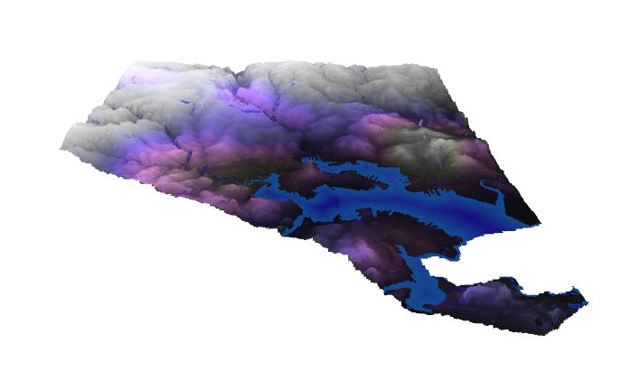

This map shows the concentration of industrial properties
 worth over $500,000 in Baltimore City. The map shows that there is a very high concentration
 of businesses that fit this description over on the southeastern side of Baltimore.
 It is also shown that there are a number of industrial properties worth this much located
 around the main rivers and bodies of water. As you get farther away from the water's edge, the amount
 of industrial properties of this value decrease.

 This data was retrieved from the Real Property Dataset
 found on the Baltimore City Open GIS Data website. The dataset was converted
 to a Spatial Lite database, and a SQL query was used to single out the industrial
 properties that were worth $500,000 or more. The query is shown in the image above.

The image above is a 3D visual of the $500,000+ Industrial Properties map.
This image helps emphasize the decrease in elevation towards the waters edge, which
is also where you see a lot of these industrial properties.

 __Languages:__ HTML, Markdown

 __Applications:__ QGIS, ArcMap, Atom

 __Projection:__ NAD 1983 State Plane Maryland 1900 Ft.

 __Data Source:__ [Baltimore City Open GIS Data](http://gis-baltimore.opendata.arcgis.com/),
 [MD iMap](https://imap.maryland.gov/Pages/lidar-dem-download-files.aspx)
 
 <small> Cover photo retrieved from: [Monster Displays](https://www.monsterdisplays.com/Baltimore-Maryland-Trade-Show-Information-s/365.htm)
