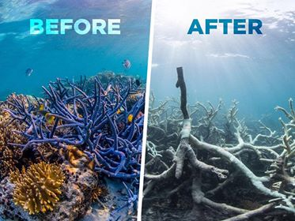

# GES 486 Project 2 

Coral reef bleaching is a major issue that has become an increasing concern
with the threat of climate change. As oceans start to warm due to a warming climate,
the coral ejects the algae that is living on or within it as a response mechanism. This causes
the coral to "bleach" and they eventually starve to death because of the lack of energy production.
This project is ultimately trying to shed light on the severity of coral bleaching around the globe,
and how it has gotten increasingly worse over just the past 50 years.



Picture from: [AtollVolunteers](https://www.atollvolunteers.com/coral-bleaching/)

This project was done using python code in QGIS to select out certain periods of ultimately
that had high amounts of coral bleaching. Below are the scripts that were used and
what each of them does.

```python
def load_raster():
    iface.addRasterLayer('C:/Users/ges_student/Desktop/NE1_50M_SR_W/NE1_50M_SR_W/NE1_50M_SR_W.tif','Natural Earth')
def run_script():
    load_raster()
run_script()
```
This code above loads in a global raster map.

```python
from qgis.core import *
from qgis.core import QgsVectorFileWriter, QgsWkbTypes

Input_Table = 'C:/Users/ges_student/Desktop/NelsonProject2/CoralBleaching.csv'
lon_field = 'LON'
lat_field = 'LAT'
crs = 4326
Output_Layer = 'C:/Users/ges_student/Desktop/NelsonProject2/CoralBleaching1.shp'

spatRef = QgsCoordinateReferenceSystem(crs, QgsCoordinateReferenceSystem.EpsgCrsId)

inp_tab = QgsVectorLayer('C:/Users/ges_student/Desktop/NelsonProject2/CoralBleaching.csv', 'Coral_Bleaching', 'ogr')
prov = inp_tab.dataProvider()
fields = inp_tab.fields()
outLayer = QgsVectorFileWriter('C:/Users/ges_student/Desktop/NelsonProject2/CoralBleaching1.gpkg', None, fields, QgsWkbTypes.Point, spatRef)

pt = QgsPointXY()
outFeature = QgsFeature()

for feat in inp_tab.getFeatures():
    attrs = feat.attributes()
    pt.setX(float(feat[lon_field]))
    pt.setY(float(feat[lat_field]))
    outFeature.setAttributes(attrs)
    outFeature.setGeometry(QgsGeometry.fromPointXY(pt))
    outLayer.addFeature(outFeature)
del outLayer
iface.addVectorLayer('C:/Users/ges_student/Desktop/NelsonProject2/CoralBleaching1.gpkg','Coral_Bleaching','ogr')
```
This code loads in a CRV file from Reef Base that has all accounts of coral bleaching from
1963 through 2012. The file also has the severity of those coral bleaching accounts. This code then
takes the CRV file and converts it into a vector shapefile using QgsVectorFileWriter.

The next group of 4 scripts are the selection scripts that select high severity coral
bleaching from 4 distinct time periods between 1963 and 2012. This is done by creating a selection
and then making a new vector file from that selection. These selections were then used to create a
gif of the change of coral bleaching over 4 periods of time.

```python
CoralBleach = QgsVectorLayer('C:/Users/ges_student/Desktop/NelsonProject2/CoralBleaching1.gpkg', 'CoralBleach')
CoralBleach.isValid()
# Should Return "True"
QgsProject.instance().addMapLayer(CoralBleach)
# Should return "<qgis._core.QgsVectorLayer object at 0x000001714E5500D8>"

selection = CoralBleach.getFeatures(QgsFeatureRequest(). setFilterExpression(u'"YEAR" < 1974 and "SEVERITY_CODE" = 3'))
CoralBleach.selectByIds([s.id() for s in selection])
iface.mapCanvas().zoomToSelected()
QgsVectorFileWriter.writeAsVectorFormat(CoralBleach, r'C:/Users/ges_student/Desktop/NelsonProject2/CoralBleaching1_1stselect.gpkg', 'utf-8', CoralBleach.crs(),'GPKG', True)

CoralBleachFirst = QgsVectorLayer('C:/Users/ges_student/Desktop/NelsonProject2/CoralBleaching1_1stselect.gpkg', 'CoralBleachFirst')
CoralBleachFirst.isValid()
QgsProject.instance().addMapLayer(CoralBleachFirst)
```
```python
CoralBleach = QgsVectorLayer('C:/Users/ges_student/Desktop/NelsonProject2/CoralBleaching1.gpkg', 'CoralBleach')
CoralBleach.isValid()
# Should Return "True"
QgsProject.instance().addMapLayer(CoralBleach)
# Should return "<qgis._core.QgsVectorLayer object at 0x000001714E5500D8>"

selection = CoralBleach.getFeatures(QgsFeatureRequest(). setFilterExpression(u'"YEAR" > 1974 and "YEAR" < 1988 and "SEVERITY_CODE" = 3'))
CoralBleach.selectByIds([s.id() for s in selection])
iface.mapCanvas().zoomToSelected()
QgsVectorFileWriter.writeAsVectorFormat(CoralBleach, r'C:/Users/ges_student/Desktop/NelsonProject2/CoralBleaching1_2ndselect.gpkg', 'utf-8', CoralBleach.crs(),'GPKG', True)

CoralBleachSecond = QgsVectorLayer('C:/Users/ges_student/Desktop/NelsonProject2/CoralBleaching1_2ndselect.gpkg', 'CoralBleachSecond')
CoralBleachSecond.isValid()
QgsProject.instance().addMapLayer(CoralBleachSecond)
```
```python
CoralBleach = QgsVectorLayer('C:/Users/ges_student/Desktop/NelsonProject2/CoralBleaching1.gpkg', 'CoralBleach')
CoralBleach.isValid()
# Should Return "True"
QgsProject.instance().addMapLayer(CoralBleach)
# Should return "<qgis._core.QgsVectorLayer object at 0x000001714E5500D8>"

selection = CoralBleach.getFeatures(QgsFeatureRequest(). setFilterExpression(u'"YEAR" > 1987 and "YEAR" < 2001 and "SEVERITY_CODE" = 3'))
CoralBleach.selectByIds([s.id() for s in selection])
iface.mapCanvas().zoomToSelected()
QgsVectorFileWriter.writeAsVectorFormat(CoralBleach, r'C:/Users/ges_student/Desktop/NelsonProject2/CoralBleaching1_3rdselect.gpkg', 'utf-8', CoralBleach.crs(),'GPKG', True)

CoralBleachThird = QgsVectorLayer('C:/Users/ges_student/Desktop/NelsonProject2/CoralBleaching1_3rdselect.gpkg', 'CoralBleachThird')
CoralBleachThird.isValid()
QgsProject.instance().addMapLayer(CoralBleachThird)
```
```python
CoralBleach = QgsVectorLayer('C:/Users/ges_student/Desktop/NelsonProject2/CoralBleaching1.gpkg', 'CoralBleach')
CoralBleach.isValid()
# Should Return "True"
QgsProject.instance().addMapLayer(CoralBleach)
# Should return "<qgis._core.QgsVectorLayer object at 0x000001714E5500D8>"

selection = CoralBleach.getFeatures(QgsFeatureRequest(). setFilterExpression(u'"YEAR" > 2000 and "SEVERITY_CODE" = 3'))
CoralBleach.selectByIds([s.id() for s in selection])
iface.mapCanvas().zoomToSelected()
QgsVectorFileWriter.writeAsVectorFormat(CoralBleach, r'C:/Users/ges_student/Desktop/NelsonProject2/CoralBleaching1_4thselect.gpkg', 'utf-8', CoralBleach.crs(),'GPKG', True)

CoralBleachFourth = QgsVectorLayer('C:/Users/ges_student/Desktop/NelsonProject2/CoralBleaching1_4thselect.gpkg', 'CoralBleachFourth')
CoralBleachFourth.isValid()
QgsProject.instance().addMapLayer(CoralBleachFourth)
```
The next two scripts were done using the same method as the previous scripts,
but instead split the data into two large sections instead of four.
The first section is 1963 to 1990 and the second is 1990 to 2012.

```python
CoralBleach = QgsVectorLayer('C:/Users/ges_student/Desktop/NelsonProject2/CoralBleaching1.gpkg', 'CoralBleach')
CoralBleach.isValid()
# Should Return "True"
QgsProject.instance().addMapLayer(CoralBleach)
# Should return "<qgis._core.QgsVectorLayer object at 0x000001714E5500D8>"

selection = CoralBleach.getFeatures(QgsFeatureRequest(). setFilterExpression(u'"year" < 1990 and "BLEACHING_SEVERITY" = \'HIGH\''))
CoralBleach.selectByIds([s.id() for s in selection])
iface.mapCanvas().zoomToSelected()
QgsVectorFileWriter.writeAsVectorFormat(CoralBleach, r'C:/Users/ges_student/Desktop/NelsonProject2/CoralBleaching1_pre1990.gpkg', 'utf-8', CoralBleach.crs(),'GPKG', True)

CoralBleachPre1990 = QgsVectorLayer('C:/Users/ges_student/Desktop/NelsonProject2/CoralBleaching1_pre1990.gpkg', 'CoralBleachPre1990')
CoralBleachPre1990.isValid()
QgsProject.instance().addMapLayer(CoralBleachPre1990)
```
```python
CoralBleach = QgsVectorLayer('C:/Users/ges_student/Desktop/NelsonProject2/CoralBleaching1.gpkg', 'CoralBleach')
CoralBleach.isValid()
# Should Return "True"
QgsProject.instance().addMapLayer(CoralBleach)
# Should return "<qgis._core.QgsVectorLayer object at 0x000001714E5500D8>"

selection = CoralBleach.getFeatures(QgsFeatureRequest(). setFilterExpression(u'"year" >= 1990 and "BLEACHING_SEVERITY" = \'HIGH\''))
CoralBleach.selectByIds([s.id() for s in selection])
iface.mapCanvas().zoomToSelected()
QgsVectorFileWriter.writeAsVectorFormat(CoralBleach, r'C:/Users/ges_student/Desktop/NelsonProject2/CoralBleaching1_post1990.gpkg', 'utf-8', CoralBleach.crs(),'GPKG', True)

CoralBleachPost1990 = QgsVectorLayer('C:/Users/ges_student/Desktop/NelsonProject2/CoralBleaching1_post1990.gpkg', 'CoralBleachPost1990')
CoralBleachPost1990.isValid()
QgsProject.instance().addMapLayer(CoralBleachPost1990)
```
Using these scripts I was able to make the selections and display them on the map. Those
vector files were then used in a kernel density estimation to create a heat map. Those heatmaps were then
made into images and finally turned into a GIF file.

The GIF below shows the increase of high accounts of coral bleaching
around the globe in four periods of time.


This second gif was made to display a more alarming scenario to see how many
high severity accounts of bleaching there were before 1990 versus after. You can
see a major increase after 1990 and a spread all around the globe.


This data analysis was only done using a selection of data from Reef Base, but there are definitely
more accounts of coral bleaching from different time periods around the globe. The data shown also only
shows high severity of bleaching and does not look at the accounts of low severity and medium severity.
If this project was to go further then those accounts would be something to consider, and maybe see if accounts
of medium severity became accounts of high severity later on. 

__Author:__ Kristian Nelson

__Languages:__ HTML, Markdown

__Applications:__ QGIS, Atom

__Projection:__ World Robinson

__Data Source:__ [Reef Base](http://www.reefbase.org/main.aspx),
[Natural Earth Data](https://www.naturalearthdata.com/downloads/50m-raster-data/)
